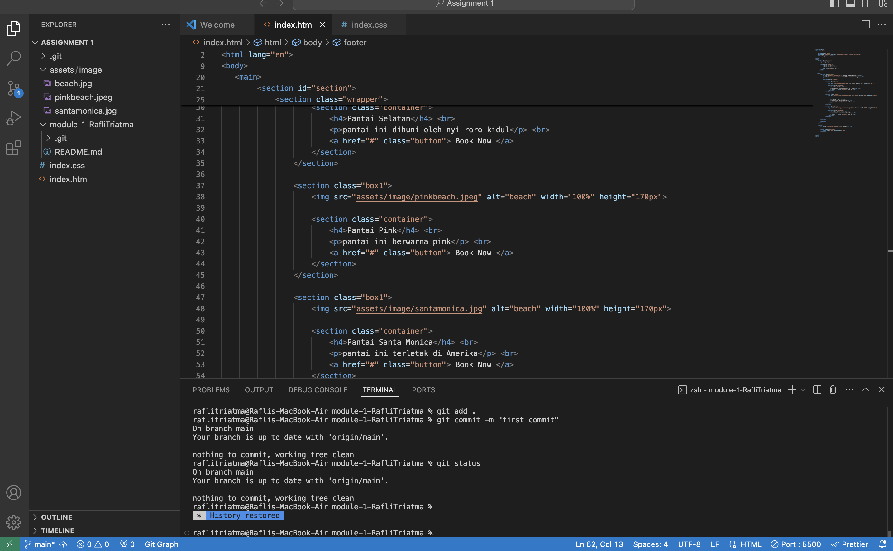
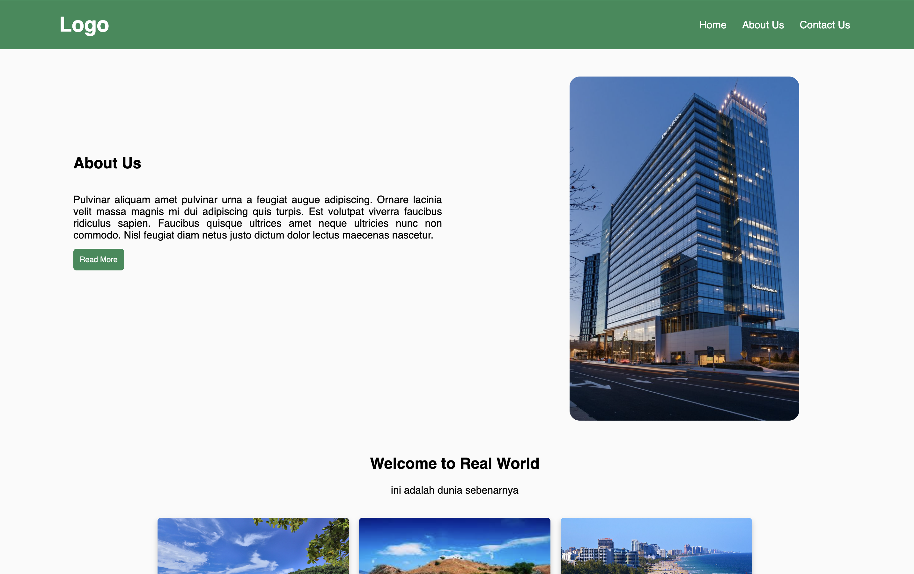

[](https://classroom.github.com/a/mEdQF3Ol)

# This is my link Website
[web saya](kerjamulu.site)

## How to Create Custom Domain
1. You need to wake up from your bed !!
2. Gather Intention
3. Turn on your device (laptop,pc, etc) and open your fav browser and write Niaga Hoster on search
4. And you can custom your Domain. 

## How to Connect your Custom Domain
1. You need to deploy your project in Netlify or Vercel
2. Klik your project and find Set Up Custom Domain
3. Put the link that has been purchased in Niaga Hoster
4. Find and Copy DNS in Netlify and change DNS in Niaga Hoster at Change Server

## Heading

saya menggunakan meta untuk menambahkan icon /gambar pada tab web saya. Untuk *styling* yang saya gunakan, saya menggunakan css. Dan saya menggunakan beberapa semantic *Tag* seperti `<section>` `<header>` `<main>` `<nav>` dan lain lain.

## Media Query
berikut saya tampilkan media query yang saya gunakan dengan ukuran (480px) dan (768px)

```
/* Media Query (768px) */
@media (max-width: 768px) {
    .header {
        padding: 20px 40px;
    }

    .header span {
        font-size: 28px;
    }

    .navbar a {
        font-size: 14px;
        margin-left: 10px;
    }

    .aboutwrap {
        flex-direction: column;
        align-items: center;
    }

    .abouttxt {
        width: 100%;
        padding: 10px;
    }

    .abouttxt h1 {
        margin-left: 0;
        padding-top: 10%;
        text-align: center;
    }

    .abouttxt p {
        margin-left: 0;
    }

    .aboutimg {
        width: 100%;
        display: flex;
        justify-content: center;
    }

    .aboutimg img {
        width: 80%;
        margin-left: 0;
    }

    .buttonabout {
        margin-left: 0;
        display: block;
        text-align: center;
    }

    .wrapper {
        flex-direction: column;
        align-items: center;
    }

    .button {
        margin-left: 0;
        display: block;
        text-align: center;
        width: 100%;
    }

    .boxform {
        width: 90%;
    }
}

/* Media Query (480px) */
@media (max-width: 480px) {
    .header {
        padding: 10px 20px;
    }

    .header span {
        font-size: 24px;
    }

    .navbar a {
        display: none;
    }

    .iconsidebar {
        display: block;
        cursor: pointer;
    }

    .about{
        padding-top: 0;
    }

    .abouttxt h1 {
        font-size: 20px;
        padding-top: 5%;
    }

    .abouttxt p {
        font-size: 14px;
    }

    .aboutimg img {
        width: 100%;
        margin-left: 0;
    }

    .buttonabout {
        width: 100%;
        margin: 10px 0;
    }

    .box1 {
        width: 90%;
    }

    .button{
        width: 100%;
    }

    .boxform {
        width: 90%;
        padding: 15px;
    }

    .boxform .btnsubmit {
        padding: 8px;
    }

    footer {
        padding: 10px 0;
    }
}
```

## Contoh Code saya


## Contoh web saya

